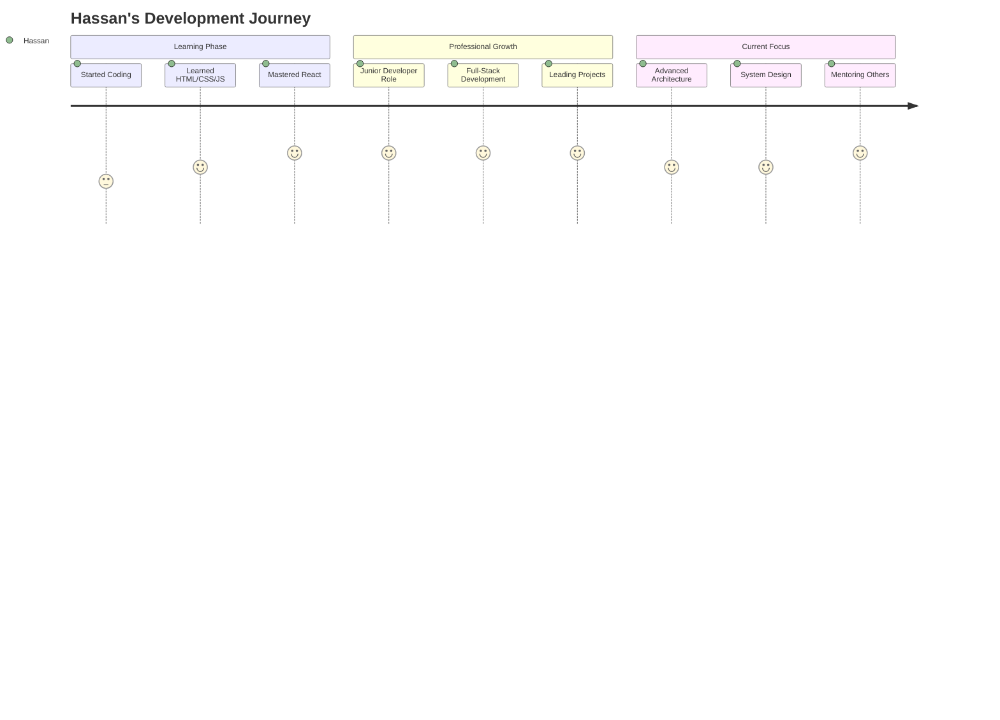
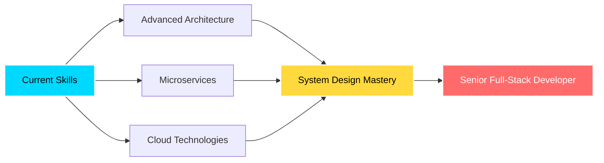

<!-- ===== Epic Animated Header ===== -->
<div align="center">
  
</div>

<!-- ===== Animated Banner with Particles ===== -->
<p align="center">
  
</p>

<!-- ===== Multi-line Typing Animation ===== -->
<p align="center">
  
  <br>
</p>

<!-- ===== Social Proof Badges ===== -->
<p align="center">
  
  
  
  <a href="https://www.linkedin.com/in/hassan-abdullah-8177573a9/"></a>
</p>

<!-- ===== Animated Separator ===== -->


## 🎯 Who Am I? Let Me Show You...

<div align="center">
  
</div>

```typescript
class FullStackDeveloper {
    name: string = "Hassan Abdullah";
    title: string = "Full-Stack Developer & Creative Designer";
    location: string = "Pakistan 🇵🇰";
    
    workExperience = {
        current: {
            role: "Full-Stack Developer & Designer",
            company: "Aurion Tech Global",
            duration: "Present",
            highlights: [
                "🚀 Building enterprise-grade applications",
                "🎨 Creating stunning visual experiences",
                "⚡ Optimizing performance & scalability",
                "👨‍💻 Mentoring junior developers"
            ]
        },
        previous: {
            role: "Junior Developer",
            company: "Expert Soft Solution",
            stack: ["React.js", "Django REST", "MongoDB"]
        }
    };
    
    skills = {
        languages: ["PHP", "JavaScript", "Python", "HTML5", "CSS3"],
        frontend: ["React.js", "Tailwind CSS", "Bootstrap"],
        backend: ["Laravel", "Django", "REST APIs"],
        databases: ["MySQL", "MongoDB"],
        design: ["Photoshop", "Illustrator", "Canva"],
        tools: ["Git", "VS Code", "Postman", "Figma"]
    };
    
    currentlyLearning = [
        "Advanced System Architecture 🏗️",
        "Microservices & API Design 🔐",
        "Performance Optimization ⚡",
        "Cloud Technologies ☁️"
    ];
    
    lifePhilosophy = "Code with passion, design with purpose, debug with patience ✨";
    
    getMotivation(): string {
        return "Transforming ideas into reality, one commit at a time! 💪";
    }
}
```


## 🌟 My Journey So Far...

<div align="center">



</div>

<table>
<tr>
<td width="50%" valign="top">

### 🎯 Current Role @ Aurion Tech Global

 **What I Do:**

- ⚡ Architect & build scalable web applications
- 🎨 Design beautiful, user-friendly interfaces
- 🔧 Optimize code for performance & maintainability
- 🤝 Collaborate with cross-functional teams
- 📈 Drive technical innovation & best practices

**Tech Stack in Action:**
- Laravel & PHP for robust backends
- React.js for dynamic frontends
- MySQL for data management
- Creative design for polished UX

</td>
<td width="50%" valign="top">

### 📚 Previous @ Expert Soft Solution

 **Key Achievements:**

- ⚛️ Built interactive React.js components
- 🐍 Developed Django REST APIs
- 📊 Managed MongoDB databases
- 🎯 Delivered projects in Agile sprints
- 💡 Contributed to team knowledge sharing

**Skills Gained:**
- Full-stack JavaScript development
- RESTful API design patterns
- NoSQL database management
- Team collaboration & Git workflows

</td>
</tr>
</table>


## My Technical Arsenal

<div align="center">

### **Languages**


###  **Frameworks & Magic Tools**


###  **Data Wizardry**


###  **Design Superpowers**


###  **Developer Toolkit**


</div>

<div align="center">
  
</div>


##  GitHub Stats & Activity

<div align="center">
  
###  **Streak Stats - Consistency is Key!**


###  **Performance Metrics**


###  **Contribution Graph - Watch Me Code!**


###  **Achievement Unlocked!**


</div>


##  What Makes Me Different?

<div align="center">

<table>
<tr>
<td width="33%" align="center">

###  **Clean Code Advocate**


I don't just write code that works—I write code that's **maintainable**, **scalable**, and a **joy to read**.

</td>
<td width="33%" align="center">

###  **Performance Enthusiast**


Every millisecond matters! I optimize for **speed**, **efficiency**, and **user experience**.

</td>
<td width="33%" align="center">

###  **Design-Minded Developer**


Beautiful code deserves a **beautiful interface**. I bridge the gap between logic and aesthetics.

</td>
</tr>
</table>

</div>

###  **My Skill Levels** (And Growing Every Day!)

<div align="center">

| **Technology** | **Proficiency** | **Experience** | **Projects** |
|:---:|:---:|:---:|:---:|
| **Laravel** |  | 2+ years | 15+ |
| **React.js** |  | 2+ years | 12+ |
| **Python/Django** |  | 2+ years | 10+ |
| **Database Design** |  | 2+ years | 20+ |
| **UI/UX Design** |  | 3+ years | 25+ |
| **API Development** |  | 2+ years | 18+ |

</div>


##  Current Focus & Learning Path

<div align="center">



</div>

<table>
<tr>
<td width="50%">

###  **Currently Mastering**

-  **Advanced Software Architecture**
  - Design Patterns & SOLID Principles
  - Microservices Architecture
  - Domain-Driven Design (DDD)

-  **API Security & Optimization**
  - OAuth 2.0 & JWT Implementation
  - Rate Limiting & Caching Strategies
  - GraphQL Integration

-  **Cloud & DevOps**
  - AWS/Azure Fundamentals
  - Docker & Kubernetes
  - CI/CD Pipelines

</td>
<td width="50%">

###  **Next on My List**

-  **Testing & Quality**
  - Test-Driven Development (TDD)
  - E2E Testing with Cypress
  - Performance Testing

-  **Mobile Development**
  - React Native
  - Progressive Web Apps (PWA)

-  **AI/ML Integration**
  - Machine Learning Basics
  - AI-Powered Features
  - Natural Language Processing

</td>
</tr>
</table>


##  Fun Facts About Me!

<div align="center">


</div>

<table>
<tr>
<td width="50%">

🌙 **Night Owl Coder**
> Best code happens between 10 PM - 2 AM ☕

💡 **Problem Solver at Heart**
> Love turning "impossible" into "deployed"

🎮 **Debugging = Gaming**
> Every bug is a boss fight waiting to be defeated

</td>
<td width="50%">

🎨 **Color Palette Perfectionist**
> Will spend 30 mins choosing the right shade of blue

📚 **Documentation Fan**
> Yes, I actually enjoy writing docs! 📝

 **Continuous Learner**
> If I'm not coding, I'm learning to code better

</td>
</tr>
</table>

### 💬 **My Coding Philosophy**

<div align="center">

> *"Code is poetry written in logic."*  
> *"First make it work, then make it beautiful, then make it fast."*  
> *"The best code is no code, but the second best is clean code."*  

</div>


##  Let's Build Something Amazing Together!

<div align="center">

###  **Open for Opportunities!**


I'm always excited to collaborate on interesting projects!  
Whether you need a **full-stack developer**, a **creative designer**, or both—let's talk!

###  **Reach Out!**

<table>
<tr>
<td align="center" width="33%">

###  Professional
[](https://www.linkedin.com/in/hassan-abdullah-8177573a9/)

Perfect for **job opportunities**  
and **professional networking**

</td>
<td align="center" width="33%">

###  Email
[](mailto:hassannabdullaho@gmail.com)

Best for **project inquiries**  
and **collaborations**

</td>
<td align="center" width="33%">

###  GitHub
[](https://github.com/abdullah3566)

Check out my **code**  
and **open-source work**

</td>
</tr>
</table>

###  **I'm Available For:**

<table>
<tr>
<td align="center">

✅ **Full-Stack Development**  
Web Applications & APIs

</td>
<td align="center">

✅ **Frontend Development**  
React.js & Modern UI

</td>
<td align="center">

✅ **Backend Development**  
Laravel & Django

</td>
</tr>
<tr>
<td align="center">

✅ **UI/UX Design**  
Beautiful Interfaces

</td>
<td align="center">

✅ **Consultation**  
Architecture & Best Practices

</td>
<td align="center">

✅ **Mentorship**  
Helping Others Grow

</td>
</tr>
</table>

###  **Quick Stats**

<p align="center">
  
  
  
  
</p>

</div>


##  Bonus: Latest GitHub Activity

<!--START_SECTION:activity-->
<!--END_SECTION:activity-->

<div align="center">

### 🐍 Watch My Contributions Get Eaten!

<picture>
  <source media="(prefers-color-scheme: dark)" srcset="https://raw.githubusercontent.com/abdullah3566/abdullah3566/output/github-contribution-grid-snake-dark.svg">
  <source media="(prefers-color-scheme: light)" srcset="https://raw.githubusercontent.com/abdullah3566/abdullah3566/output/github-contribution-grid-snake.svg">
  
</picture>

</div>


## 💝 Support My Work

<div align="center">

If you like what I do, consider giving my repositories a !  
It motivates me to create more awesome stuff! 

###  **Star My Repos** • 👀 **Follow My Journey** • 🔄 **Share With Others**


### 📈 **Profile Views Counter**


</div>


<!-- ===== Inspirational Quote ===== -->
<div align="center">
  
</div>


<!-- ===== Epic Footer Wave ===== -->
<div align="center">
  
</div>

<div align="center">
  
###  Don't forget to star repositories you find interesting! 


**Made with ❤️ by Hassan Abdullah**

*Happy Coding! Keep Building Amazing Things! *

</div>

---

<div align="center">
  
  
  
</div>
